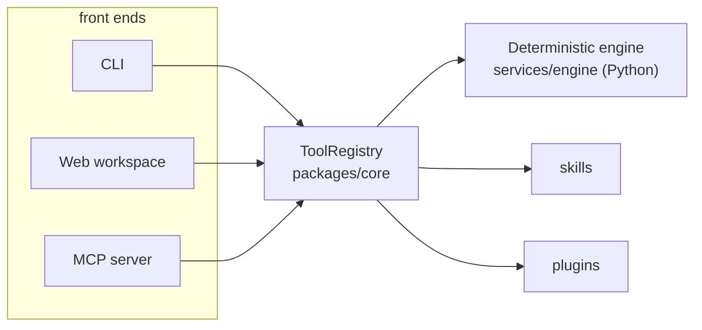
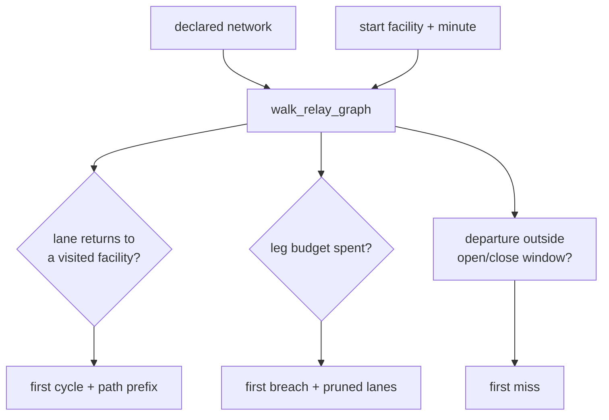

<div align="center">

# LanePlan Relay

**Declare your relay lanes, walk the graph, and get the first handoff that loops, blows the visit budget, or misses its window — deterministically, from every surface.**

[Live app](https://laneplan-relay.vercel.app) ·
[Source](https://github.com/aniruddhaadak80/laneplan-relay) ·
[CI](https://github.com/aniruddhaadak80/laneplan-relay/actions/workflows/ci.yml) ·
[Issues](https://github.com/aniruddhaadak80/laneplan-relay/issues)

`TypeScript monorepo` · `Python engine` · `MCP server` · `MIT`

</div>

---

## The problem

A freight relay chain is a walk over a graph. Origin, a few lanes, some handoffs, a
destination. Two things go wrong in practice, and both are silent:

1. **A lane returns to somewhere the chain has already been.** A planner without a visited
   set will follow it forever, or quietly truncate and call that a route.
2. **The chain outgrows its budget.** Every extra handoff is another slot to book, another
   dwell to absorb, another place for the load to sit until someone notices.

Today you find out at 2am, at a facility, with a load that cannot move. Or you hand-check the
graph in a spreadsheet.

LanePlan Relay walks the graph you declared and tells you **where** it first fails, with the
exact path that reached the failure.

## Why the answer is code, not a model

Whether a chain closes a loop is a graph fact. Whether a departure falls inside its window is
arithmetic. Both must be **reproducible**: the same declared network has to produce the same
verdict today, tomorrow, and in front of your auditor.

So the walk is a dependency-free Python engine — no clock, no network, no randomness, no model.
It is spawned as a pure function over stdin/stdout, which means there is no server to run and
two concurrent calls can never interleave state. Every emitted collection is explicitly sorted,
so output ordering cannot depend on dict iteration order.

```console
$ laneplan mcp call walk_relay_graph '{"network":{"facilities":[{"id":"A","name":"PortA","kind":"port"},{"id":"B","name":"HubB","kind":"hub"}],"lanes":[{"id":"ab","fromFacility":"A","toFacility":"B","dwellMinutes":10,"transitMinutes":60,"openMinute":0,"closeMinute":10080},{"id":"ba","fromFacility":"B","toFacility":"A","dwellMinutes":10,"transitMinutes":60,"openMinute":0,"closeMinute":10080}]},"startFacility":"A","maxLegs":4}'
{
  "engine": "1.0.0",
  "plans": [],
  "planCount": 0,
  "legsWalked": 1,
  "branchesPruned": 1,
  "cycle": {
    "laneId": "ba",
    "facility": "A",
    "path": ["A", "B", "A"]
  },
  "budget": null,
  "windowMiss": null,
  "maxLegs": 4,
  "startFacility": "A"
}
```

Lane `ba` returns to `A`, which the walk has already visited. That is the whole answer, and it
is the answer you could not get by reading the JSON by eye.

> On Windows PowerShell 5.1, escape the inner quotes before passing JSON to a native
> executable, or write the document to a file first. `bash` and `zsh` take the form above as-is.

## Quick start

```bash
git clone https://github.com/aniruddhaadak80/laneplan-relay.git
cd laneplan-relay
npm install
npm run build
node packages/cli/dist/bin.js doctor
```

`doctor` probes the runtime, the skills catalog, the plugins and the config, and prints a fix
hint per failing row.

## Walkthrough

Every command below was run against this repository.

### 1. See the capability list

```bash
node packages/cli/dist/bin.js tools
```

Eight tools, each with a declared permission set. `walk_relay_graph`, `find_cycles` and
`score_handoff` are the product; the rest are the plumbing this repo is built on.

### 2. Walk a network

```bash
node packages/cli/dist/bin.js mcp call walk_relay_graph '<your network JSON>'
```

Reports ranked plans, the first cycle with its closing lane, the first visit-budget breach and
the first missed window — in one pass.

### 3. Enumerate every loop, ignoring time

```bash
node packages/cli/dist/bin.js mcp call find_cycles '<your network JSON>'
```

Useful as a regression check on a declared network. Each loop is rotated to a canonical
starting facility, so the output is stable enough to diff.

### 4. Score one handoff

```bash
node packages/cli/dist/bin.js mcp call score_handoff '<network + facility>'
```

A 0–100 score with itemised weighted factors — dwell pressure, window tightness, fanout,
inbound criticality — and an actionable recommendation. Read the factors, not just the total.

### 5. Inspect the extension surfaces

```bash
node packages/cli/dist/bin.js skills
node packages/cli/dist/bin.js plugins
```

Skills are markdown loaded from disk with frontmatter validation; an invalid skill is reported
with a reason, never silently skipped. Plugins resolve by priority, and a shadowed plugin is
reported rather than dropped.

### 6. Prove the MCP surface

```bash
node scripts/prove-mcp.mjs
```

```
MCP proof: stdio transport, real SDK client

  [PASS] initialize — server laneplan-relay v0.1.0
  [PASS] tools/list returns the relay tools — 8 tools: engine_diff, engine_normalize, engine_summarize, find_cycles, list_plugins, list_skills, score_handoff, walk_relay_graph
  [PASS] walk_relay_graph publishes a structured input schema — required: network, startFacility
  [PASS] tools/call find_cycles reaches the Python engine — found 1 loop, closing lane str-ham
  [PASS] tools/call walk_relay_graph reports the closing edge — NLRTM -> DEHAM -> FRAXF -> STRIG -> DEHAM closed by str-ham
  [PASS] the same call is byte-identical across calls — deterministic
  [PASS] tools/call score_handoff returns itemised factors — score 30 (low) from 4 factors
  [PASS] an unknown facility is rejected, with the engine code preserved — NOT_FOUND: UNKNOWN_FACILITY: startFacility 'NOWHERE' is not in the network
  [PASS] a missing network is rejected at the boundary — VALIDATION_FAILED: "network" must be an object

9/9 checks passed
```

This launches `mcp serve` as a child process and drives it with the real MCP SDK client. It is
not a mock.

### 7. Connect an agent

```json
{
  "mcpServers": {
    "laneplan-relay": {
      "command": "node",
      "args": ["packages/cli/dist/bin.js", "mcp", "serve"]
    }
  }
}
```

LanePlan Relay is not only an MCP client — it runs a server, which makes it a tool provider for
other agents.

### 8. Run the whole gate

```bash
npm run check
```

The exact command CI runs, in the same order.

## Architecture



One registry, one `Tool` interface. A surface is a transport, never a second implementation —
which is why the web workspace calls the same Python engine the CLI does instead of
reimplementing the walk in TypeScript. There is no TypeScript copy of the walk to drift.



The engine stops a branch for exactly three reasons and records the first occurrence of each.

### Invariants

1. Tools are **stateless**. State lives in `packages/memory`.
2. Input is validated **before** the handler runs.
3. Permissions are **declared**, and a call exceeding the granted set is refused.
4. A duplicate tool name **throws**, naming both registrants.
5. No cross-package deep imports — `check:boundaries` fails otherwise.

### The footprint ladder

Where new capability goes, in order: extend an existing tool → CLI command plus a skill →
service-gated tool → plugin → MCP server tool → new core tool (**last resort**). Every core
tool is paid for in context on every request forever; plugins are free.

## What ships

| Surface              | Status     | What it is                                                      |
| -------------------- | ---------- | --------------------------------------------------------------- |
| CLI                  | shipped    | `doctor`, `tools`, `skills`, `plugins`, `mcp serve`, `mcp call` |
| Deterministic engine | shipped    | pure Python over stdin/stdout; 50 tests incl. property tests    |
| MCP server           | shipped    | 8 tools over stdio, proven against a real client                |
| Web workspace        | shipped    | Next.js, `/workspace` and `/api/walk`                           |
| MCP client           | shipped    | connects to configured servers                                  |
| Skills catalog       | shipped    | `SKILL.md` discovery, validation, version gating                |
| Plugin registry      | shipped    | manifest validation, priority conflict resolution               |
| Memory               | shipped    | SQLite, WAL, numbered migrations, FTS5                          |
| Channels             | scaffolded | one `Channel` interface with a local adapter; not load-bearing  |
| Desktop shell        | scaffolded | Electron around the web app; not load-bearing                   |

The last two are inherited from the architecture this repo is built on and are real and tested,
but nothing in the relay workflow needs them. They are listed as scaffolded rather than claimed
as load-bearing.

## Known limitation

**The web workspace needs a Python interpreter on the host.** `/api/walk` spawns the engine;
on a serverless Node runtime there is no `python`, so the route returns `503 ENGINE_UNAVAILABLE`
and the UI shows that as an explicit, designed error state. It never substitutes a guess — a
plausible-looking answer from the wrong engine would be worse than no answer. Self-host, or use
the CLI or MCP server, which are the load-bearing surfaces.

## Project map

```
apps/web/            Next.js app: /, /workspace, /surfaces, /health, /api/health, /api/walk
apps/desktop/        Electron shell around the web build
packages/core/       Tool interface, registry, permissions, error taxonomy
packages/engine-client/ typed bridge to the Python engine + error-code translation
packages/mcp/        MCP server (stdio) and MCP client
packages/skills/     SKILL.md loader, frontmatter parsing, catalog
packages/plugins/    manifest loader, schema validation, conflict resolution
packages/memory/     SQLite store, WAL, numbered migrations, FTS
packages/cli/        commander CLI, the tool registry assembly, doctor
services/engine/     the deterministic engine and its pytest suite
skills/              the skill catalog
scripts/             policy gates and prove-mcp.mjs
```

## Gates

```bash
npm run check          # format, lint, typecheck, 6 policy gates, tests, pytest, build
python -m pytest services/engine -q
python -m ruff check services/engine
node scripts/prove-mcp.mjs
```

CI runs the same aggregate gate in named jobs: `Format`, `Lint`, `Typecheck`, `Test`,
`Python test`, `Build`, `Secret scan`.

## Documentation

| Page                                       | Read it when                              |
| ------------------------------------------ | ----------------------------------------- |
| [getting-started](docs/getting-started.md) | you have just cloned this                 |
| [architecture](docs/architecture.md)       | you need the map before changing anything |
| [cli](docs/cli.md)                         | you are scripting the CLI                 |
| [mcp](docs/mcp.md)                         | you are connecting an agent               |
| [skills](docs/skills.md)                   | you are writing or editing a skill        |
| [plugins](docs/plugins.md)                 | you are adding an extension               |
| [ci](docs/ci.md)                           | you are adding a gate                     |
| [adr/](docs/adr/)                          | you want the reasoning behind a decision  |

Contributing: [CONTRIBUTING.md](CONTRIBUTING.md). The rules that are not negotiable are in
[AGENTS.md](AGENTS.md).

## License

MIT — see [LICENSE](LICENSE). Third-party notices in [THIRD_PARTY_NOTICES.md](THIRD_PARTY_NOTICES.md).
